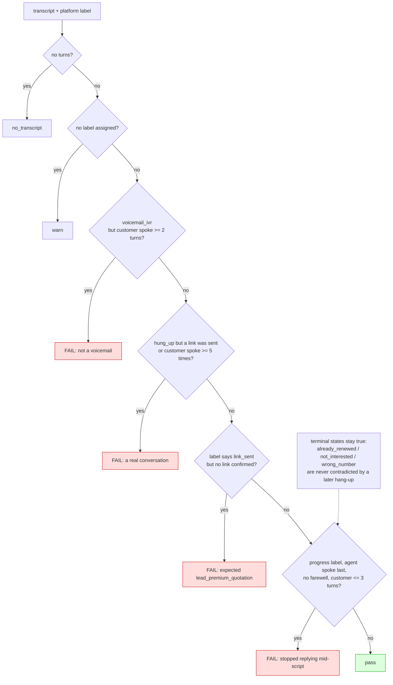
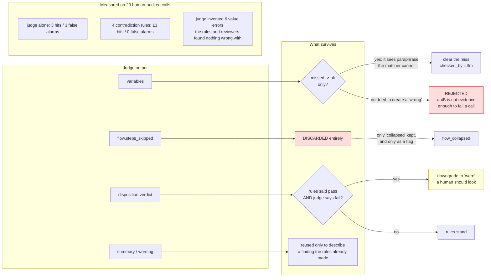
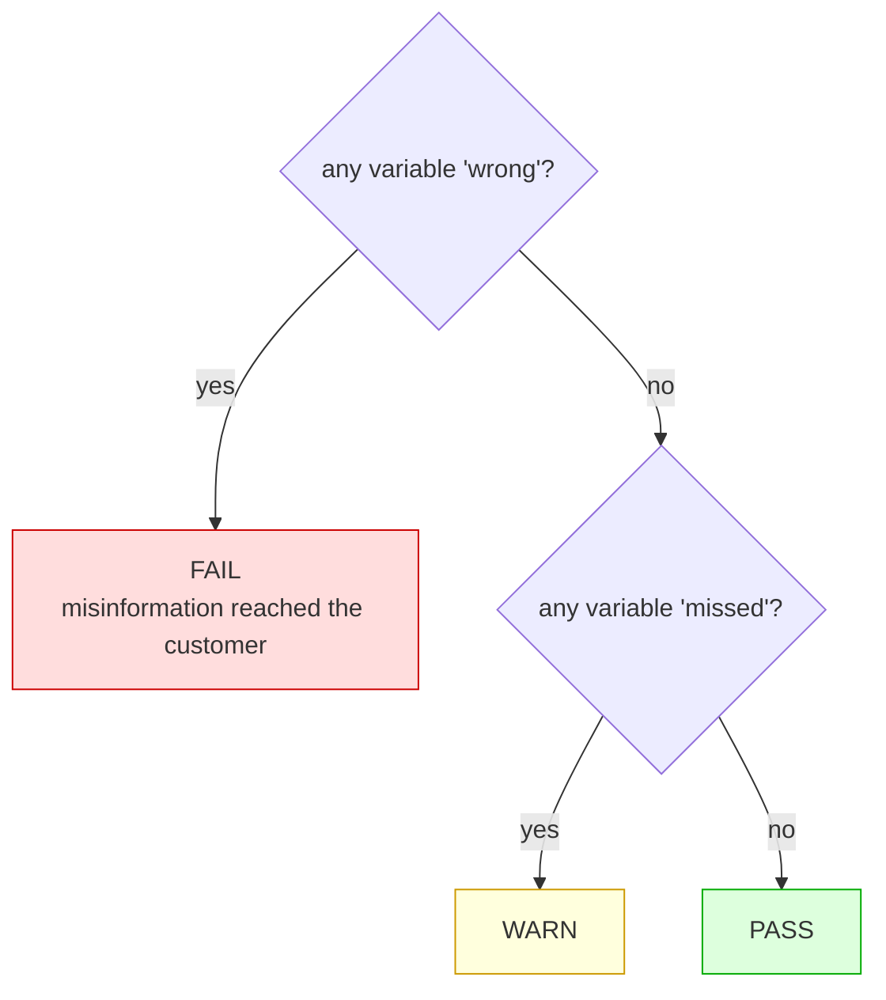
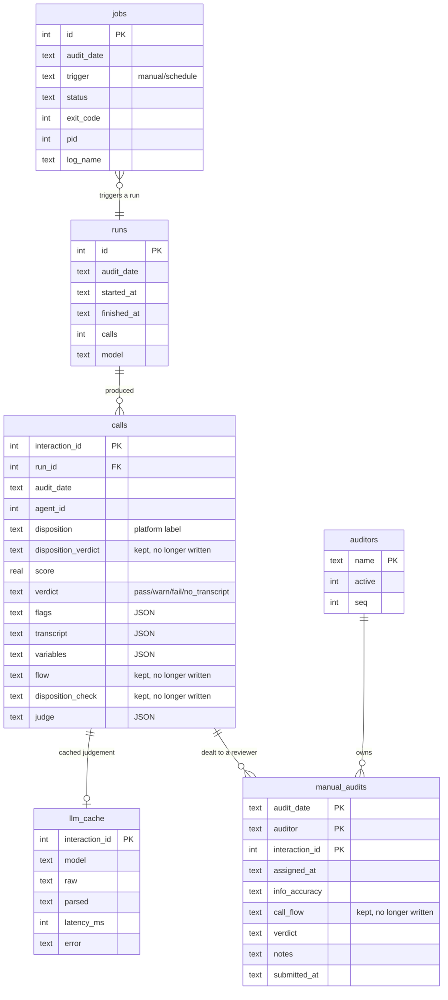

# Architecture and design

How the call-audit system is put together, and *why* — the reasoning behind the
decisions that are not obvious from the code. [README.md](../README.md) is the
quickstart; this is the design record.

> **Scope change, 3 Sep 2026.** The engine used to grade three axes: variables,
> flow and disposition. It now grades **one - variable accuracy** - and the score
> is 100% that. Flow detection survives as a *reachability gate only* (see 4a);
> disposition is displayed as the platform assigned it and is no longer
> second-guessed. The reviewer's own "Call Flow" dropdown and the export column
> behind it are gone too, so the CSV is 16 columns and no longer matches the old
> workbook exactly. The deleted disposition rules are recoverable:
> `git log -S check_disposition -- audit/rules.py`. Sections 4c, 6 and 7 record
> what those rules were and why they were good, because the day someone asks to
> turn them back on, that reasoning is the expensive part.

- [1. What the system is for](#1-what-the-system-is-for)
- [2. The pipeline](#2-the-pipeline)
- [3. Stage 0 — fetching](#3-stage-0--fetching)
- [4. Stage 1 — the rules](#4-stage-1--the-rules)
- [5. Stage 2 — the judge](#5-stage-2--the-judge)
- [6. Arbitration: what the judge may change](#6-arbitration-what-the-judge-may-change)
- [7. Scoring and the verdict gate](#7-scoring-and-the-verdict-gate)
- [8. The manual layer](#8-the-manual-layer)
- [9. Scheduling and process model](#9-scheduling-and-process-model)
- [10. Data model](#10-data-model)
- [11. API surface](#11-api-surface)
- [12. Configuration](#12-configuration)
- [13. Deployment](#13-deployment)
- [14. Calibration: how we know it works](#14-calibration-how-we-know-it-works)
- [15. Known limits](#15-known-limits)
- [16. Decision log](#16-decision-log)

---

## 1. What the system is for

Two audits, sharing one database.

| | Engine audit | Manual audit |
|---|---|---|
| Covers | every call of a day, thousands | 10 calls × 3 reviewers |
| Decided by | rules + a 4B judge | a human |
| Purpose | find the calls worth a human's ear, pre-fill the columns | the final word |
| Output | `calls` table, dashboard | `manual_audits` table, 16-column CSV |

The engine exists so a person never has to listen to a voicemail or type a
transcript. The humans exist because no model is trusted with the final word.
The manual layer replaces the `Chola Call Audits.xlsx` tracker — one sheet per
reviewer, ten rows a day — and its CSV is shaped to go straight where the
workbook went.

**The central idea:** the feed tells us what the agent *was told to say*
(`additional_variables` — RED date, premium, NCB, DTD, reg no, make, model,
customer name). So "did the agent say it, and say it right" is a mechanical
problem, not a judgement. That is why the model's role is as small as it is.

---

## 2. The pipeline

```mermaid
flowchart TD
    T1["Operator: Run now"] --> JOBS
    T2["Nightly schedule<br/>IST, jobs.py"] --> JOBS
    JOBS["api/jobs.start<br/>one at a time, subprocess"] --> RUN["python -m audit.run --date X"]

    RUN --> FETCH["audit/data.fetch_day"]
    FETCH --> MB[("Metabase<br/>public.interactions<br/>outlet_id 1497")]
    MB --> PAGE["_paged: keyset id > last<br/>1000 per page"]
    PAGE --> CAP{"page == 2000 rows?"}
    CAP -->|yes| BOOM["RAISE: result truncated<br/>never silently short"]
    CAP -->|no| ROWS["rows: messages,<br/>additional_variables,<br/>lead_stage_computed"]

    ROWS --> HAS{"has transcript?"}
    HAS -->|no| NOTX["verdict = no_transcript<br/>skip everything else"]
    HAS -->|yes| RULES

    subgraph RULES["Stage 1 — deterministic rules"]
        direction TB
        R1["detect_flow<br/>5 steps, per-agent regex markers"]
        R2["flow_rows<br/>a step is required only if<br/>the call got that far"]
        R3["check_variables<br/>8 injected values<br/>words to int, Indic digits, 7 date shapes"]
        R1 --> R2 --> R3
        NOTE2["flow decides reachability only:<br/>nothing is scored or flagged on it"]
    end

    RULES --> RESIDUE["residue = variables marked 'missed'"]

    RESIDUE --> CACHE{"llm_cache hit<br/>for this interaction_id?"}
    CACHE -->|yes| PARSED
    CACHE -->|no| JUDGE

    subgraph JUDGE["Stage 2 — Qwen 4B judge"]
        direction TB
        J1["build_prompt<br/>rubric 1200 + transcript 4000 + answer 1400"]
        J2{"transcript over budget?"}
        J3["middle-drop<br/>2/3 opening, 1/3 close"]
        J4["POST /chat/completions<br/>temperature 0, json_object<br/>40 per chunk, 8 concurrent"]
        J5["_parse: tolerate fences and trailing prose"]
        J1 --> J2
        J2 -->|yes| J3 --> J4
        J2 -->|no| J4
        J4 --> J5
    end

    JUDGE --> STORE["_cache_put: cached forever<br/>re-score costs no GPU"]
    STORE --> PARSED["parsed JSON or a recorded parse failure"]

    PARSED --> MERGE["audit_one: arbitration"]
    MERGE --> SCORE["_score: 100% variable accuracy"]
    SCORE --> VERD["verdict gate"]
    VERD --> DB[("data/audits.db<br/>calls table")]
    NOTX --> DB
    DB --> UI["FastAPI :8085<br/>+ React dashboard"]
```



---

## 3. Stage 0 — fetching

`audit/data.py`

Source is Metabase over `/api/dataset`, filtered to `outlet_id = 1497` and one
IST day. Three things there are load-bearing.

### The 2,000-row cap

Metabase silently truncates a native query at 2,000 rows. No error, no flag in
the response body, just a short list.

On 31 Aug there were 5,757 calls and it returned 2,000. Because the query was
`ORDER BY i.id`, the 3,757 dropped were the whole back half of the day — which
is **every Tamil call**, since agent 127's campaign is dialled after agent 125's.
The day read as fully audited and was not.

`run_native_sql` now raises if a result lands exactly on the cap
(`data.py:81`). Anything that legitimately returns that many goes through
`_paged()`. A loud failure beats another silently half-audited day.

### Keyset paging, not OFFSET

`interactions` is being written to while an audit runs, and `OFFSET` over a
moving table skips rows. Paging is on `id > last`, which is the primary key —
both stable under concurrent inserts and indexed.

### Duration

`ended_time - created_at` spans the whole dial attempt, not the conversation: it
reads 5,860s on a one-turn call. The real figure is
`interaction_metadata->>'call_duration'`, which matches the human sheet exactly
on all 20 ground-truth rows. The reports repo independently settled on the same
column.

### The clock

Two separate faults, both fixed in `audit/data.py`:

`created_at` is not when the call happened — it is when the platform queued the
row. A whole batch shares one microsecond (five leads at `06:27:53.302174`, one
of which ended 49 minutes later), so the call list stacked 4,460 calls onto a
single instant. The conversation is the tail of the last dial attempt:
`ended_time - call_duration`. With no duration nobody spoke, so `ended_time` —
when we stopped trying — is used instead; only if that is missing does the queue
time stand in. The worst pile-up on 3 Sep falls from 4,460 rows to 57.

`created_at` and `ended_time` are `timestamp WITHOUT time zone` holding **naive
UTC**, the convention the reports repo documents in `interaction_export.sql`.
Metabase's report timezone is Asia/Kolkata, so it stamped a `+05:30` onto the
naive value without converting it, and every clock in the UI ran 5h30m early —
`06:18 am` for a call placed at `11:48 IST`. The select now converts
(`AT TIME ZONE 'UTC' AT TIME ZONE 'Asia/Kolkata'`) so the offset is true.

Consequently an audit day is now an **IST** day. `fetch_day` shifts the window
rather than converting the column, so the `created_at` index still applies. The
day's membership changes slightly: 3 Sep went from 10,426 rows to 8,857.

### Retries

The gateway in front of Metabase intermittently 502/503/504s on queries that
succeed moments later. Four attempts, exponential backoff from 5s.

---

## 4. Stage 1 — the rules

`audit/rules.py` — everything a regex can decide is decided here, so the 4B only
ever sees the residue.

### 4a. Flow

Five steps, detected by per-agent regex markers (`rules.py:361`):

| Step | Label | Marker (125 / Hindi) |
|---|---|---|
| step1 | Identity & greeting | `simran\|सिमरन` |
| step2 | Disclosure + vehicle/expiry anchor | `record की जा\|training और quality` |
| step3 | Discount + premium | `renewal premium\|percent एन-सी-बी\|de-tariff` |
| step4 | Payment link | `payment link\|link भेज\|whatsapp` |
| step5 | Objection / routing | `sales team\|quotation\|branch\|callback` |

Two refinements carry most of the correctness:

- **Step 1 counts only as the opener.** A later name-drop is not a re-greeting,
  so it does not reset the order check (`rules.py:397`).
- **A step is required only once the call got that far** (`flow_rows`): the
  previous step was delivered *and* the agent spoke again afterwards.

Since the scope change, that second point is the *whole* purpose of flow
detection. Nothing is scored, flagged or reported on the strength of a step. It
exists so `check_variables` knows how far the call actually got: without it, a
call that died in the greeting reports six `missed` variables it never had the
chance to say, and the one number the product now reports would be measuring the
customer hanging up rather than the agent.

### 4b. Variables

Eight checks. The hard part is that the transcript is spoken Hinglish/Tanglish
and the feed is data — a premium of 91,894 is spoken *"ninety-one thousand eight
hundred ninety-four"*. Both sides are parsed to integers and the **integers** are
compared, which survives every reformatting the agent does out loud (hyphens,
"and", stray spaces) without modelling any of it.

| Value | How it is found |
|---|---|
| premium | a number with `rupees / रुपये / ரூபாய்` within 5 tokens |
| ncb, dtd | a number with `percent / % / प्रतिशत` within 2 tokens; the **following** words disambiguate NCB from DTD, since both read "*n* percent" |
| red | a day-number adjacent to a month name — English, Devanagari or Tamil |
| reg_no | `T-N nine-one A-Y` canonicalised to `TN91AY`: digit-words to digits, then all separators stripped, so hyphen noise cannot cause a false miss |
| make, model, customer_name | half the significant tokens present, case-blind |

Three verdicts, and the distinction matters:

- `ok` — said, and said right.
- `missed` — never said. **Silence is not misinformation.**
- `wrong` — a *different* value was said as that field. Only this forces a fail.

One inversion worth knowing (`rules.py:470`): if NCB or DTD was **not** supplied,
the clause is meant to be omitted entirely. If the agent quotes any figure for it
anyway, that is inventing a discount — recorded as `wrong`. It is the single most
common human verification finding.

If a call ended before a step, its variables are `not_reached`, never `missed`.

### 4c. Disposition - removed 3 Sep 2026

**No longer in the code.** Kept here as the design record, because these rules
were the most accurate thing the engine did and someone will ask for them back.
`git log -S check_disposition -- audit/rules.py` restores them.

What they were: four contradiction rules, run against the platform's own label.



The fourth rule discriminates carefully: only labels claiming the pitch *got
somewhere* (`_PROGRESS_LABELS`) can be contradicted this way. A terminal customer
state — already renewed, not interested, wrong number — stays true even if the
customer then puts the phone down.

These four were **derived from the reviewers' own findings** on the 20
hand-audited calls: every disposition error they recorded is one of these four,
and these four fire on none of the calls they passed. The thresholds (≥2 customer
turns for voicemail, ≥5 for a hang-up, ≤3 for a drop) were calibrated on those
20 calls only.

The one thing their removal broke, and how it was patched: the manual sample used
`disposition_verdict = 'fail'` to keep mislabelled voicemails in the human pool
(section 8). That now keys on turn count instead - a real conversation talks
back, an answering machine does not.

---

## 5. Stage 2 — the judge

`audit/judge.py` — a local Qwen 4B behind vLLM. It sees only the **residue**:
the variables the matcher marked `missed`, and nothing else. It is asked three
things - adjudicate those variables, summarise the call, phrase the verification
error. The flow and disposition questions were removed with the axes they served.
The rubric still ships the workflow, because a variable is identified by the step
it belongs to.

### Prompt budget

8192 context, carved up:

| Segment | Budget |
|---|---|
| rubric | 1,200 |
| transcript | 4,000 |
| answer reserve | 1,400 |

Token counts are **estimated locally**, because vLLM exposes no `/tokenize`
(404 on `/v1/tokenize`) and tiktoken cannot download its BPE from that host. The
estimate deliberately over-counts: Devanagari and Tamil fragment badly and run
near one token per character, against 3.3 chars/token for Latin. Truncating
slightly early is cheap; a 400 from the server mid-run is not.
`calibration_report()` compares the estimate against the `usage.prompt_tokens`
the server actually returns — a ratio ≥ 1.0 means the estimate is safe.

### Middle-dropping

Over-length transcripts keep two thirds of the budget for the opening and one
third for the close, with `... [n turns omitted] ...` between. The graded content
— disclosure, premium, link, hang-up — sits at both ends. A head-only truncation
would lose every link and every farewell.

### Robustness

`judge()` **never raises**. A parse failure is recorded as a parse failure, not
as a verdict — a 4B failing to close a brace must not become "the call failed".
`_parse` also tolerates markdown fences and trailing prose. One bad call must not
kill a run of thousands.

Results are cached in `llm_cache` by interaction id, so re-running after a
scoring change costs no GPU time at all.

---

## 6. Arbitration: what the judge may change

The safety core. Every rule here is a measured result from the 20 hand-audited
calls, not a preference.



In prose:

- **Variables** — the judge may only *clear* a `missed` → `ok`. It sees
  paraphrase the matcher cannot. It may **not** create a `wrong`: that forces a
  fail, and a 4B's opinion is not evidence enough to call a call non-compliant.
  Deterministic wins.
- **Flow, disposition** — no longer asked. Historically: the judge's flow step
  list was discarded entirely (it reported step1/step2 skipped on calls whose
  opening turn plainly contained both), and a judge-only disposition objection
  became `warn`, never `fail`.
- **Wording** — findings come from the matcher; the judge's phrasing is reused
  only to describe a finding the rules already made. Given free rein it invented
  six value errors on the ground-truth set that both the rules and the reviewers
  found nothing wrong with.

The single sentence version: **the model can only ever make a call look better,
never worse.** Everything that can fail a call is deterministic and re-derivable.

---

## 7. Scoring and the verdict gate

Score out of 100 (`run.py:_score`): **of the values the agent actually said, the
proportion said right** - `ok / (ok + wrong)`. One axis, no weights.

Only *spoken* values are graded, as of 3 Sep 2026. A variable the agent never
said (`missed`) has no spoken value to be accurate about, so it does not enter
the denominator. It is not swept away: it still raises `missing_variable`, still
counts in `variables_failed`, still holds the call at `warn`, and still has its
own column in the Overview table. It simply cannot make the accuracy figure read
as though a wrong number was said to a customer, which is what the figure is for.

`not_reached` and `n/a` were already excluded, so a call that ended early is
never marked down for values it had no chance to reach. A call with nothing
spoken scores 100, not 0 - there is no evidence of anything wrong, and a 0 would
put an innocent call at the top of a worst-first list.

Consequence worth knowing: an agent that says nothing at all scores 100 and
warns. The score answers "was what was said correct", not "was the script
completed" - read it next to the `missed` column, never alone.

It was 50 variables / 20 flow / 30 disposition until 3 Sep 2026. Rows audited
before that date still carry a score on the old scale; re-running a day
re-scores it, and costs no GPU time because `llm_cache` is keyed on
`interaction_id`, not on the prompt.

The verdict is **separate from the score** and is a three-way gate:



Why not just threshold the score: a call can score 85 and still have quoted the
wrong premium. Misinformation reaching the customer is categorical, not a
deduction.

---

## 8. The manual layer

`api/manual.py`

```mermaid
flowchart TD
    OPEN["Anyone opens a day<br/>nothing schedules this"] --> ENS["ensure_assigned(date)"]
    ENS --> HELD{"every active reviewer<br/>already has 10?"}
    HELD -->|yes| RET["return the same ten<br/>stable across refreshes"]
    HELD -->|no| POOL

    subgraph POOL["_ordered_pool"]
        direction TB
        P0[("calls table for that day")]
        P1["exclude verdict = no_transcript<br/>never connected"]
        P2{"disposition = voicemail_ivr?"}
        P3["exclude it"]
        P4["KEEP IT<br/>it talked back, so the label is wrong:<br/>exactly what a human wants to hear"]
        P0 --> P1 --> P2
        P2 -->|"and turns < 6"| P3
        P2 -->|"but turns >= 6"| P4

        T1["Tier 1: >= 4 turns AND >= 60s"]
        T2["Tier 2: >= 2 turns AND >= 20s<br/>top-up only, never blended"]
        P3 --> T1
        P4 --> T1
        T1 --> IL1["_interleave by agent_id<br/>round-robin proportional to group size"]
        T1 -.->|"thin day: a half-day<br/>or a bank holiday"| T2
        T2 --> IL2["_interleave again"]
        IL1 --> ORD["ordered pool"]
        IL2 --> ORD
    end

    POOL --> SH["_shuffled: md5 of 'date:id'<br/>NOT python hash - that is salted per process<br/>and would re-deal on every API restart"]
    SH --> DEAL["deal 10 per active reviewer<br/>skipping anything already owned"]
    DEAL --> UNIQ[("UNIQUE(audit_date, interaction_id)<br/>one call, one owner")]

    UNIQ --> Q["queue: recording, transcript,<br/>pre-call injected values,<br/>platform disposition, engine verdict + score"]
    Q --> SUB["submit: Info Accuracy / Call Flow /<br/>Final Disposition / Notes"]
    SUB --> DRAFT{"verdict picked?"}
    DRAFT -->|no| D1["draft: saved, submitted_at stays null"]
    DRAFT -->|yes| D2["submitted_at = now IST"]

    D1 --> REP
    D2 --> REP
    REP["report(date_from, date_to, agent_id)"] --> LANG{"agent_id given?"}
    LANG -->|"127"| TA["agent_id = 127 -> Tamil"]
    LANG -->|"125 or anything else"| HI["agent_id IS NOT 127 -> Hindi<br/>same rule the Language column uses<br/>so the halves always sum to the whole"]
    LANG -->|no| BOTH["both"]
    TA --> CSV["16-column CSV<br/>language in the filename"]
    HI --> CSV
    BOTH --> CSV

    style P4 fill:#dfd,stroke:#0a0
    style HI fill:#dfd,stroke:#0a0
```



### The voicemail carve-out

A genuine voicemail is thirty seconds of an answering machine — the engine's job,
not a person's. But voicemails are excluded **only where the call is also
short** (`turns < 6`). A real conversation mislabelled voicemail is exactly what
a human most wants to hear, and it gives itself away by talking back; an
answering machine does not.

Until 3 Sep 2026 this keyed on `disposition_verdict = 'fail'` — the engine's own
objection to the label. When disposition verification was removed that column
went permanently NULL, which would have silently dropped *every* voicemail-labelled
call, mislabelled ones included: the pool would have looked healthy while quietly
hiding the calls the sample exists to surface.

### Two tiers, not one blended pool

Tier 1 is ≥4 turns and ≥60s. Tier 2 (≥2 turns, ≥20s) is a **top-up only**, for a
thin day — a half-day of dialling, a bank holiday. One flat pool would deal a
20-second wrong number ahead of a four-minute conversation on a day that had
plenty of both.

### Language interleaving

`_interleave` round-robins proportional to each group's size, so a language that
is 12% of the day is roughly 12% of every reviewer's ten. Without it, Tamil went
unaudited by hand for a fortnight while the Hindi campaign filled every sheet.

### Stable shuffle

`hashlib.md5(f"{date}:{id}")`, not Python's `hash()` — that is salted per
interpreter, so it would deal a different ten every time the API restarted.

### Lazy assignment

Nothing schedules the deal. The first time anyone opens a day, the ten are dealt
and written down; every later read returns the same ten. This keeps a reviewer's
list stable across refreshes without another timer to babysit. A `UNIQUE` index
on `(audit_date, interaction_id)` guarantees one call has exactly one owner — two
reviewers on the same call is wasted listening and two contradictory report rows.

### Partial saves

Notes alone is a draft; `submitted_at` is only set when a verdict is picked. A
reviewer half way through a call should not lose the fields they already chose.

### The language split

`report()` filters on **exactly the rule the `Language` column uses** — 127 is
Tamil, everything else is Hindi — so the two downloads always add back up to the
whole.

An exact `agent_id = 125` match does not. Agent **124** exists in the live data
(6 calls, one already dealt to a reviewer) and is labelled Hindi, so exact
matching dropped it from *both* halves at once. A row in neither download is
invisible twice over, which is worse than a row in the wrong one. `IS NOT` rather
than `!=` so a `NULL` agent_id still lands in Hindi instead of being dropped by
SQL's three-valued logic.

---

## 9. Scheduling and process model

`api/jobs.py`

Two triggers — an operator pressing "Run now", and a nightly schedule — both end
in the same place: a `python -m audit.run --date X` **subprocess**, one at a
time, with its output kept so a failed night can be read the next morning.

**Why a subprocess, not a thread:** an audit that dies (OOM on a long transcript,
a Metabase error escaping the retry loop) takes only its own process down and the
API keeps serving the dashboard. It also keeps the CLI as the single definition
of what an audit *is* — no second code path that can drift.

**No `start_new_session`:** the child stays in the API's cgroup, so systemd takes
it down with the service. Otherwise a restart orphans an audit that keeps writing
rows nothing is tracking.

**On startup**, any job still marked `running` is reconciled to `interrupted` —
that state can only mean the service died mid-run.

**Concurrency:** a threading lock plus a live `Popen` check. Two audits at once
would fight over the same rows.

**Timezone:** everything is IST (`Asia/Kolkata`). The calls are dialled in India,
so "last night" and "today's calls" mean nothing in the VM's UTC clock.

**No catch-up window** (marked `ponytail:`): if the service is down all evening
and returns the next day, that night is skipped and the operator presses Run now.
Add a window if it ever actually bites.

**WAL mode** on the SQLite connection: the audit subprocess writes for minutes at
a stretch, and without WAL every dashboard read during a run risks "database is
locked".

---

## 10. Data model

One SQLite file, `data/audits.db`.



Notes:

- `calls` is written with `INSERT OR REPLACE`, so re-auditing a day overwrites it
  cleanly rather than duplicating.
- The JSON columns (`transcript`, `variables`, `judge`) keep the full evidence
  for every finding, so the UI can show *which turn* proves a verdict without
  re-running anything.
- Six columns survive the 3 Sep scope change unwritten: `flow_score`,
  `disposition_verdict`, `disposition_error`, `flow`, `disposition_check` and
  `manual_audits.call_flow`. Migrating a live SQLite file to drop them buys
  nothing, and an empty column is more honest than a stale one — old rows keep
  the values they were actually audited with, and reverting is a `git revert`
  rather than a schema restore.
- `llm_cache` is keyed only by interaction id and survives re-runs, so a scoring
  change is free.
- `auditors` rows are **deactivated, never deleted** — a departed reviewer's
  finished audits must stay in the report.
- `audit_date` on `manual_audits` is the day the calls were *made*, not the day
  they were reviewed.

---

## 11. API surface

`api/main.py`, served on `:8085`, with the built SPA on the same origin.

| Method | Path | Purpose |
|---|---|---|
| GET | `/api/health` | liveness + model + db presence |
| GET | `/api/dates` | which days have audits |
| GET | `/api/summary` | dashboard counts for a day |
| GET | `/api/calls` | list, filtered by date / agent / verdict / text |
| GET | `/api/calls/{id}` | one call with transcript, variables, flow, evidence |
| GET | `/api/export.csv` | engine results, per day, filterable |
| GET | `/api/runs` | run history |
| GET/POST | `/api/jobs` | list / start an audit |
| GET | `/api/jobs/{id}` | status + log tail |
| POST | `/api/jobs/{id}/cancel` | terminate a running audit |
| GET/PUT | `/api/schedule` | nightly schedule settings |
| GET | `/api/manual/options` | auditors + allowed dropdown values |
| PUT | `/api/manual/auditors` | replace the roster |
| GET | `/api/manual/queue` | one reviewer's ten for a day |
| GET | `/api/manual/progress` | per-reviewer assigned/done |
| POST | `/api/manual/{id}` | submit or draft one review |
| GET | `/api/manual/export.csv` | the 16-column workbook CSV, date range + language |
| GET | `/{path}` | SPA fallback |

`check_date()` validates every date before it reaches SQL, because `fetch_day`
interpolates the date straight into the query.

---

## 12. Configuration

`.env` at the repo root, plus any matching environment variable (env wins).

| Key | Purpose |
|---|---|
| `METABASE_URL`, `METABASE_API_KEY`, `METABASE_DB_ID` | the call source |
| `QWEN_BASE_URL`, `QWEN_API_KEY`, `QWEN_MODEL` | the judge |
| `QWEN_MAX_CONCURRENCY` | parallel judge calls, default 8 |
| `AUDIT_DATE` | default day for a bare `python -m audit.run` |

`load_env` only lets through variables already present in `.env` or prefixed
`METABASE_` / `QWEN_` / `AUDIT_`, so the process environment cannot inject
arbitrary config.

---

## 13. Deployment

Oracle VM, `/opt/apps/call-audits`, systemd unit `chola-audits` on `:8085`,
behind the same nginx as the other Chola apps.

```bash
# on the VM
cd /opt/apps/call-audits
git pull --ff-only
sudo systemctl restart chola-audits
```

The web build (`web/dist`) is committed/copied rather than built on the VM.
`data/audits.db` lives on the VM and is **not** in git.

---

## 14. Calibration: how we know it works

`audit/validate.py` grades the engine against 20 hand-audited calls from
27 Aug 2026 (`data/ground_truth/human_audits_2026-08-27.csv`).

Agreement is measured **the way the humans record it**: did the reviewer write
anything in `Verfication Error`, and did we? (The sheet's `Dispostion Error`
column is still parsed and echoed, but no longer graded — nothing in the engine
produces a disposition verdict to grade it against.)
Their exact wording is not compared — two auditors phrase the same finding
differently, and scoring on string equality would measure vocabulary rather than
agreement.

Results that shaped the design:

| Measured | Result | Consequence |
|---|---|---|
| judge alone on disposition | 3 hits / 3 false alarms | judge demoted to a second opinion (axis since removed) |
| 4 contradiction rules | 13 hits / 0 false alarms | rules owned the disposition verdict (axis since removed) |
| judge on variable values | invented 6 errors the rules and reviewers both cleared | judge may never create a `wrong` |
| judge on flow | reported step1/step2 skipped on calls whose opening turn contained both | flow output discarded entirely |

Every "the judge is not allowed to do X" rule in §6 traces to a row in this
table. None of them is a preference.

---

## 15. Known limits

1. **One axis means one failure mode is measured.** A call can now score 100
   having said every injected value correctly and still have skipped the
   disclosure, quoted a premium to an answering machine, or been filed under the
   wrong outcome. The engine is silent on all of that by design as of 3 Sep 2026.
   The disposition rules that used to catch the third case scored 13 hits and 0
   false alarms against the reviewers (§14) and are one `git revert` away.

2. **Agent 124 has no name anywhere in the app.** Six calls, labelled Hindi by
   default because it is not 127. The manual download handles it; the Calls-page
   agent dropdown still offers only 125 and 127, so its calls are reachable in
   "all agents" and in no per-language option there.

3. **The engine CSV export is single-day**; the manual export takes a date range.

4. **`prompts/125.md` and `prompts/127.md` (383 KB) are read by no code.** The
   rubrics in `rubric/*.json` were distilled from them by hand. Either wire them
   in or delete them.

5. **No catch-up window on the scheduler** — see §9.

---

## 16. Decision log

| # | Decision | Alternative rejected | Why |
|---|---|---|---|
| 1 | Rules first, model on the residue only | model reads every call and decides everything | a 4B is not reliable enough to fail a call; and most of the work is exact string/number matching, which a regex does perfectly and for free |
| 2 | The model may only improve a verdict, never worsen it | trust it symmetrically | measured: it invents failures (§14). Asymmetry means every failure is deterministic and re-derivable |
| 3 | Compare parsed integers, not strings | normalise the spoken form with a grammar | both sides reduce to a number; the reformatting the agent does out loud stops mattering entirely |
| 4 | Raise on a 2,000-row result | raise the Metabase limit | the limit is server-side and silent. A loud failure is the only safe response to a cap you cannot turn off |
| 5 | Keyset paging | `LIMIT/OFFSET` | the table is written to during a run; OFFSET skips rows |
| 6 | Subprocess per audit | thread in the API process | crash isolation, and one definition of "an audit" |
| 7 | Lazy assignment of manual audits | a nightly deal job | no extra timer, and the list is stable by construction |
| 8 | MD5 shuffle | `random.shuffle` / `hash()` | must be stable across processes and restarts |
| 9 | Two tiers with a top-up | one pool sorted by duration | a thin day should still fill ten slots without dealing junk ahead of real calls on a normal day |
| 10 | Language interleaving | random sampling | random sampling left Tamil unaudited for a fortnight |
| 11 | Cache judgements by interaction id | re-judge on every run | re-scoring is frequent, GPU time is not free |
| 12 | Split the language download on `!= 127` | `= 125` | agent 124 exists; exact matching drops it from both halves |
| 13 | Verdict is a gate, not a threshold on the score | `score < 70 = fail` | a wrong premium is categorical, not a deduction |
| 14 | Estimate tokens locally, over-counting | trust the server to truncate | vLLM has no `/tokenize`; a 400 mid-run costs more than truncating early |
| 15 | One axis: variable accuracy only (3 Sep 2026) | keep flow and disposition | asked for. Variables are the axis the feed makes mechanical, so it is the axis the engine can be trusted on without a human |
| 16 | Keep flow detection as a reachability gate | delete it with the axis | without it a call that died in the greeting reports six `missed` variables it never had the chance to say — the one remaining number would measure the customer |
| 17 | Keep the dropped columns, stop writing them | migrate the SQLite schema | empty is more honest than stale, old rows keep what they were audited with, and reverting is a `git revert` not a schema restore |
